# Arquitectura Técnica - FarmaciaDescuento

## Índice

1. [Visión General](#visión-general)
2. [Stack Tecnológico Principal](#stack-tecnológico-principal)
3. [Diagrama de Arquitectura](#diagrama-de-arquitectura)
4. [Descripción de Servicios y Componentes](#descripción-de-servicios-y-componentes)
5. [Flujos Clave del Sistema](#flujos-clave-del-sistema)

---

## Visión General

La arquitectura del sistema FarmaciaDescuento se basa en un enfoque moderno utilizando Nuxt.js para el frontend y Firebase como plataforma de backend. Esta arquitectura permite un desarrollo rápido, escalable y mantenible que satisface los requerimientos funcionales y no funcionales del sistema, aprovechando los servicios cloud de Google Cloud Platform (GCP).

---

## Stack Tecnológico Principal

### Frontend
- **Nuxt 3**: Framework basado en Vue 3 para desarrollo de aplicaciones web
- **Vue 3**: Biblioteca JavaScript para construir interfaces de usuario con Composition API
- **Tailwind CSS**: Framework CSS para diseño responsivo y personalizable
- **Firebase SDK**: Para comunicación con los servicios de Firebase

### Backend
- **Firebase**: Plataforma de desarrollo de aplicaciones
  - **Firestore**: Base de datos NoSQL en tiempo real
  - **Firebase Authentication**: Sistema de autenticación
  - **Firebase Storage**: Almacenamiento de archivos
  - **Firebase Functions**: Funciones serverless para lógica de negocio
  - **Firebase Hosting**: Alojamiento de aplicaciones web
  - **Firebase Cloud Messaging**: Notificaciones push
  - **Dataconnect**: Servicio para conexión de datos
- **Resend**: Servicio de envío de correos electrónicos transaccionales
- **Google Cloud Platform**: Infraestructura cloud para servicios adicionales

### Aplicación Móvil
- **Flutter**: Framework para desarrollo de aplicaciones móviles multiplataforma
- **Firebase SDK para Flutter**: Para comunicación con los servicios de Firebase

### Infraestructura y DevOps
- **Google Cloud Build**: Integración y despliegue continuo
- **Firebase Hosting**: Despliegue de aplicaciones web
- **Google Cloud Run**: Para servicios adicionales
- **Firebase Performance Monitoring**: Monitoreo de rendimiento
- **Firebase Crashlytics**: Seguimiento de errores en aplicaciones móviles

## Diagrama de Arquitectura

```mermaid
flowchart TD
    %% Definición de estilos
    classDef clientLayer fill:#f9d6d2,stroke:#d86e6a,stroke-width:2px
    classDef firebaseLayer fill:#d2e5f9,stroke:#6a96d8,stroke-width:2px
    classDef gcpLayer fill:#d2f9d6,stroke:#6ad86e,stroke-width:2px
    classDef serviceLayer fill:#f9f9d2,stroke:#d8d86a,stroke-width:2px
    
    %% Capa de Clientes
    subgraph ClientLayer["CAPA DE CLIENTES"]
        WebApp["Aplicación Web<br>(Nuxt 3)"]
        MobileApp["Aplicación Móvil<br>(Flutter)"]
        AdminPanel["Panel de<br>Administración<br>(Nuxt 3)"]
    end
    
    %% Capa de Firebase
    subgraph FirebaseLayer["CAPA DE FIREBASE"]
        Auth["Firebase<br>Authentication"]
        Firestore["Firestore<br>Database"]
        Storage["Firebase<br>Storage"]
        Functions["Firebase<br>Functions"]
        Hosting["Firebase<br>Hosting"]
        FCM["Firebase Cloud<br>Messaging"]
        Dataconnect["Firebase<br>Dataconnect"]
    end
    
    %% Capa de GCP
    subgraph GCPLayer["CAPA DE GOOGLE CLOUD PLATFORM"]
        CloudRun["Cloud Run"]
        CloudFunctions["Cloud Functions"]
        BigQuery["BigQuery"]
        CloudStorage["Cloud Storage"]
    end
    
    %% Servicios Externos
    subgraph ExternalServices["SERVICIOS EXTERNOS"]
        EmailProvider["Proveedor de<br>Email"]
        Maps["Google Maps<br>API"]
        PaymentGateway["Pasarela de<br>Pagos"]
    end
    
    %% Conexiones
    WebApp <--> Auth
    WebApp <--> Firestore
    WebApp <--> Storage
    WebApp <--> Functions
    WebApp <--> Hosting
    
    MobileApp <--> Auth
    MobileApp <--> Firestore
    MobileApp <--> Storage
    MobileApp <--> Functions
    MobileApp <--> FCM
    
    AdminPanel <--> Auth
    AdminPanel <--> Firestore
    AdminPanel <--> Storage
    AdminPanel <--> Functions
    
    Firestore <--> Dataconnect
    Functions <--> CloudFunctions
    Functions <--> CloudRun
    Firestore <--> BigQuery
    Storage <--> CloudStorage
    
    Functions <--> EmailProvider
    Functions <--> Maps
    Functions <--> PaymentGateway
    FCM <--> MobileApp
    
    %% Aplicar estilos
    class ClientLayer clientLayer
    class FirebaseLayer firebaseLayer
    class GCPLayer gcpLayer
    class ExternalServices serviceLayer
```



### Descripción de Componentes

#### Capa de Clientes
- **Aplicación Web (Nuxt 3)**: Interfaz principal para usuarios compradores y farmacias
- **Aplicación Móvil (Flutter)**: Versión móvil para usuarios en dispositivos iOS y Android
- **Panel de Administración (Nuxt 3)**: Interfaz especializada para administradores de la plataforma

#### Capa de Firebase
- **Firebase Authentication**: Gestión de usuarios, autenticación y autorización
- **Firestore Database**: Base de datos NoSQL en tiempo real para almacenamiento de datos estructurados
- **Firebase Storage**: Almacenamiento de archivos (imágenes de productos, documentos)
- **Firebase Functions**: Funciones serverless para lógica de negocio
  - **Servicio de Tickets**: Genera, valida y gestiona el ciclo de vida de los tickets
  - **Servicio de Notificaciones**: Maneja notificaciones push y en tiempo real
  - **Servicio de Reportes**: Genera informes y análisis
  - **Servicio de Email**: Gestiona el envío de correos electrónicos
- **Firebase Hosting**: Alojamiento de la aplicación web
- **Firebase Cloud Messaging**: Para notificaciones push en dispositivos móviles
- **Firebase Dataconnect**: Servicio para conexión y sincronización de datos

#### Capa de Google Cloud Platform
- **Cloud Run**: Para servicios adicionales que requieran más recursos
- **Cloud Functions**: Funciones serverless complementarias
- **BigQuery**: Para análisis de datos y reportes avanzados
- **Cloud Storage**: Almacenamiento adicional para copias de seguridad y archivos de gran tamaño

#### Servicios Externos
- **Proveedor de Email**: Servicio para envío masivo de correos
- **Google Maps API**: Para geolocalización de farmacias
- **Pasarela de Pagos**: Para procesamiento de pagos en línea

## Componentes Principales

### 1. Aplicación Web (Nuxt 3)

La aplicación web será desarrollada utilizando Nuxt 3, la última versión del framework basado en Vue 3 que proporciona renderizado del lado del servidor (SSR), generación de sitios estáticos, renderizado híbrido y otras características avanzadas.

**Características clave:**
- Renderizado del lado del servidor para mejor SEO y rendimiento
- Estructura de directorios organizada y convenciones claras
- Sistema de rutas automático
- Composition API para una mejor organización del código
- Gestión de estado con Pinia (recomendado para Vue 3)
- Integración con Firebase SDK para comunicación con el backend
- Soporte para TypeScript

**Módulos principales:**
- Autenticación y gestión de usuarios (Firebase Authentication)
- Búsqueda y exploración de productos
- Gestión de carrito y proceso de compra
- Panel de administración (para farmacias y administradores)
- Notificaciones y alertas

### 2. Firebase como Backend

Firebase proporcionará una plataforma completa para el backend, ofreciendo servicios de base de datos, autenticación, almacenamiento y funciones serverless.

**Características clave:**
- Firestore: Base de datos NoSQL en tiempo real
- Firebase Authentication: Sistema de autenticación seguro y flexible
- Firebase Storage: Almacenamiento de archivos
- Firebase Functions: Funciones serverless para lógica de negocio
- Firebase Hosting: Alojamiento de aplicaciones web
- Firebase Cloud Messaging: Notificaciones push
- Dataconnect: Servicio para conexión y sincronización de datos

**Funcionalidades principales:**
- Gestión de datos de usuarios, farmacias y productos
- Control de acceso basado en roles (RBAC)
- Validación de datos y restricciones
- Sincronización en tiempo real
- Escalabilidad automática

### 3. Firebase Functions

Para lógica de negocio compleja, se implementarán funciones serverless con Firebase Functions.

**Funcionalidades principales:**
- Procesamiento de pagos
- Envío de notificaciones y correos electrónicos
- Integración con servicios externos (mapas, verificación, etc.)
- Lógica de negocio específica y validaciones complejas
- Generación de reportes y análisis
- Triggers automáticos basados en cambios en la base de datos

### 4. Firestore Database

Firestore servirá como el sistema de gestión de base de datos principal, almacenando todos los datos estructurados del sistema.

**Características clave:**
- Base de datos NoSQL orientada a documentos
- Sincronización en tiempo real
- Consultas flexibles y eficientes
- Escalabilidad automática
- Soporte offline

**Colecciones principales:**
- Usuarios y perfiles
- Farmacias y sucursales
- Productos y categorías
- Inventario y disponibilidad
- Pedidos y transacciones
- Notificaciones y alertas

### 5. Aplicación Móvil (Flutter)

La aplicación móvil será desarrollada utilizando Flutter para proporcionar una experiencia nativa en iOS y Android.

**Características clave:**
- Interfaz de usuario nativa y fluida
- Integración con Firebase SDK para Flutter
- Almacenamiento local para funcionamiento offline con Firestore
- Notificaciones push con Firebase Cloud Messaging
- Geolocalización para farmacias cercanas con Google Maps API

**Módulos principales:**
- Autenticación y perfil de usuario
- Búsqueda y exploración de productos
- Gestión de carrito y proceso de compra
- Seguimiento de pedidos
- Notificaciones y alertas

## Flujos de Datos Principales

### 1. Registro y Autenticación de Usuarios

```
Cliente -> Nuxt.js/Flutter -> Servicio de Autenticación -> Hasura -> PostgreSQL
```

1. El usuario ingresa sus datos en la aplicación
2. La aplicación envía los datos al servicio de autenticación
3. El servicio valida los datos y crea/autentica al usuario
4. Se genera un token JWT con los roles y permisos
5. El cliente almacena el token y lo utiliza para futuras solicitudes

### 2. Búsqueda y Exploración de Productos

```
Cliente -> Nuxt.js/Flutter -> Hasura GraphQL -> PostgreSQL
```

1. El usuario ingresa criterios de búsqueda
2. La aplicación construye una consulta GraphQL
3. Hasura procesa la consulta y aplica permisos
4. Se ejecutan consultas optimizadas en PostgreSQL
5. Los resultados se devuelven al cliente

### 3. Generación y Uso de Tickets de Descuento

```
[Generación]
Cliente -> Nuxt.js/Flutter -> Hasura -> Servicio de Tickets -> Servicio de Email -> Cliente

[Validación]
Farmacia -> Nuxt.js -> Hasura -> PostgreSQL -> Farmacia
```

1. El usuario selecciona productos con descuento y confirma su carrito
2. La aplicación envía la solicitud de ticket a Hasura
3. El servicio de tickets genera un código único y QR
4. Se registra el ticket en la base de datos con estado "activo"
5. Se envía el ticket por correo electrónico al cliente
6. El cliente presenta el ticket en la farmacia física
7. La farmacia escanea o ingresa el código del ticket
8. El sistema valida el ticket y confirma el descuento
9. La farmacia aplica el descuento en la venta física
10. El sistema actualiza el estado del ticket a "utilizado"

## Consideraciones de Seguridad

### Autenticación y Autorización
- Implementación de JWT para autenticación
- Control de acceso basado en roles (RBAC) en Hasura
- Políticas de permisos a nivel de fila y columna
- Validación de tokens en cada solicitud

### Protección de Datos
- Cifrado de datos sensibles en la base de datos
- HTTPS para todas las comunicaciones
- Sanitización de entradas para prevenir inyecciones
- Protección contra ataques comunes (XSS, CSRF)

### Auditoría y Monitoreo
- Registro de actividades críticas
- Monitoreo de patrones de acceso sospechosos
- Alertas automáticas ante comportamientos anómalos
- Revisiones periódicas de seguridad

## Escalabilidad y Rendimiento

### Estrategias de Caché
- Caché de consultas en Hasura
- CDN para activos estáticos
- Caché del lado del cliente en Apollo
- Redis para caché de sesiones y datos frecuentes

### Optimización de Base de Datos
- Índices para consultas frecuentes
- Particionamiento de tablas grandes
- Consultas optimizadas
- Monitoreo de rendimiento

### Escalabilidad Horizontal
- Arquitectura de microservicios para servicios Node.js
- Balanceo de carga para el frontend
- Replicación de base de datos
- Contenedores y orquestación para escalar servicios

## Entornos y Despliegue

### Entornos
- Desarrollo: Para desarrollo activo
- Pruebas: Para QA y pruebas de integración
- Staging: Réplica de producción para pruebas finales
- Producción: Entorno para usuarios finales

### Estrategia de Despliegue
- CI/CD automatizado
- Pruebas automáticas antes del despliegue
- Despliegues canary para reducir riesgos
- Rollback automático en caso de fallos

## Integración con Servicios Externos

### Sistema de Tickets de Descuento
- Generación de tickets con códigos únicos y QR
- Sistema de validación de tickets en tiempo real
- Seguimiento del estado de los tickets (activo, utilizado, vencido)
- Estadísticas de uso de tickets y descuentos aplicados

### Servicios de Geolocalización
- Integración con APIs de mapas
- Cálculo de distancias y rutas
- Búsqueda de farmacias cercanas

### Notificaciones
- Notificaciones push para aplicaciones móviles
- Correos electrónicos transaccionales
- SMS para alertas importantes

## Monitoreo y Observabilidad

### Herramientas de Monitoreo
- Logs centralizados
- Métricas de rendimiento
- Trazas de transacciones
- Alertas automáticas

### KPIs Técnicos
- Tiempo de respuesta de API
- Tasa de errores
- Uso de recursos
- Disponibilidad del sistema

## Próximos Pasos y Evolución

### Fase 1: MVP
- Implementación de funcionalidades core
- Arquitectura básica y escalable
- Pruebas con usuarios reales

### Fase 2: Expansión
- Funcionalidades avanzadas
- Optimizaciones de rendimiento
- Integración con más servicios externos

### Fase 3: Escalabilidad
- Arquitectura distribuida
- Optimizaciones para alto tráfico
- Expansión geográfica
