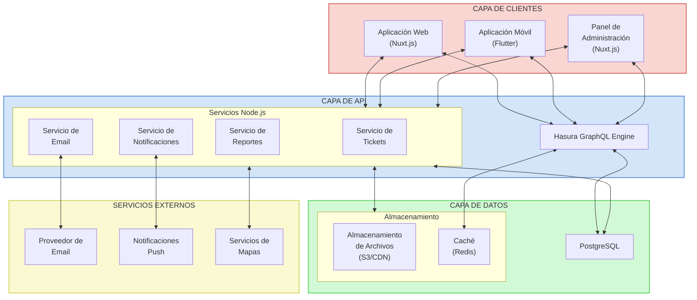

# Arquitectura Técnica - FarmaciaDescuento

## Visión General

La arquitectura del sistema FarmaciaDescuento se basa en un enfoque moderno utilizando Nuxt.js para el frontend y Hasura como capa de GraphQL API y gestión de datos. Esta arquitectura permite un desarrollo rápido, escalable y mantenible que satisface los requerimientos funcionales y no funcionales del sistema.

## Stack Tecnológico Principal

### Frontend
- **Nuxt.js**: Framework basado en Vue.js para desarrollo de aplicaciones web
- **Vue.js**: Biblioteca JavaScript para construir interfaces de usuario
- **Tailwind CSS**: Framework CSS para diseño responsivo y personalizable
- **Apollo Client**: Cliente GraphQL para comunicación con el backend

### Backend
- **Hasura**: Motor GraphQL que proporciona API instantáneas sobre PostgreSQL
- **PostgreSQL**: Sistema de gestión de base de datos relacional
- **Node.js**: Para servicios personalizados y lógica de negocio específica
- **Express.js**: Framework web para Node.js (acciones personalizadas)

### Aplicación Móvil
- **Flutter**: Framework para desarrollo de aplicaciones móviles multiplataforma
- **GraphQL**: Para comunicación con el backend (Hasura)

### Infraestructura y DevOps
- **Docker**: Contenedores para desarrollo y despliegue
- **Kubernetes**: Orquestación de contenedores (opcional para producción)
- **CI/CD**: Integración y despliegue continuo
- **Monitoreo**: Herramientas para seguimiento de rendimiento y errores

## Diagrama de Arquitectura



### Descripción de Componentes

#### Capa de Clientes
- **Aplicación Web (Nuxt.js)**: Interfaz principal para usuarios compradores y farmacias
- **Aplicación Móvil (Flutter)**: Versión móvil para usuarios en dispositivos iOS y Android
- **Panel de Administración (Nuxt.js)**: Interfaz especializada para administradores de la plataforma

#### Capa de API
- **Hasura GraphQL Engine**: Proporciona API GraphQL sobre PostgreSQL, gestiona permisos y suscripciones en tiempo real
- **Servicios Node.js**:
  - **Servicio de Tickets**: Genera, valida y gestiona el ciclo de vida de los tickets
  - **Servicio de Notificaciones**: Maneja notificaciones push y en tiempo real
  - **Servicio de Reportes**: Genera informes y análisis
  - **Servicio de Email**: Gestiona el envío de correos electrónicos

#### Capa de Datos
- **PostgreSQL**: Base de datos principal del sistema
- **Almacenamiento**:
  - **S3/CDN**: Para imágenes de productos y archivos estáticos
  - **Redis**: Para caché y gestión de sesiones

#### Servicios Externos
- **Proveedor de Email**: Servicio para envío masivo de correos
- **Notificaciones Push**: Para notificaciones en dispositivos móviles
- **Servicios de Mapas**: Para geolocalización de farmacias

## Componentes Principales

### 1. Aplicación Web (Nuxt.js)

La aplicación web será desarrollada utilizando Nuxt.js, un framework basado en Vue.js que proporciona renderizado del lado del servidor (SSR), generación de sitios estáticos y otras características avanzadas.

**Características clave:**
- Renderizado del lado del servidor para mejor SEO y rendimiento
- Estructura de directorios organizada y convenciones claras
- Sistema de rutas automático
- Gestión de estado con Vuex
- Integración con Apollo Client para comunicación GraphQL

**Módulos principales:**
- Autenticación y gestión de usuarios
- Búsqueda y exploración de productos
- Gestión de carrito y proceso de compra
- Panel de administración (para farmacias y administradores)
- Notificaciones y alertas

### 2. API GraphQL (Hasura)

Hasura proporcionará una capa de API GraphQL sobre PostgreSQL, permitiendo un desarrollo rápido y eficiente.

**Características clave:**
- API GraphQL instantánea sobre la base de datos
- Sistema de permisos basado en roles
- Suscripciones en tiempo real
- Acciones personalizadas para lógica de negocio compleja
- Eventos para integraciones con servicios externos

**Funcionalidades principales:**
- Gestión de datos de usuarios, farmacias y productos
- Control de acceso basado en roles (RBAC)
- Validación de datos y restricciones
- Consultas optimizadas y eficientes

### 3. Servicios Node.js

Para lógica de negocio compleja que no puede ser manejada directamente por Hasura, se implementarán servicios Node.js.

**Funcionalidades principales:**
- Procesamiento de pagos
- Envío de notificaciones y correos electrónicos
- Integración con servicios externos (mapas, verificación, etc.)
- Lógica de negocio específica y validaciones complejas
- Generación de reportes y análisis

### 4. Base de Datos PostgreSQL

PostgreSQL servirá como el sistema de gestión de base de datos principal, almacenando todos los datos estructurados del sistema.

**Características clave:**
- Soporte para JSON y JSONB para datos semi-estructurados
- Funciones y procedimientos almacenados para lógica de base de datos
- Triggers para mantener la integridad de los datos
- Índices para consultas eficientes
- Particionamiento para manejo de grandes volúmenes de datos

**Esquema principal:**
- Usuarios y perfiles
- Farmacias y sucursales
- Productos y categorías
- Inventario y disponibilidad
- Pedidos y transacciones
- Notificaciones y alertas

### 5. Aplicación Móvil (Flutter)

La aplicación móvil será desarrollada utilizando Flutter para proporcionar una experiencia nativa en iOS y Android.

**Características clave:**
- Interfaz de usuario nativa y fluida
- Comunicación con el backend mediante GraphQL
- Almacenamiento local para funcionamiento offline
- Notificaciones push
- Geolocalización para farmacias cercanas

**Módulos principales:**
- Autenticación y perfil de usuario
- Búsqueda y exploración de productos
- Gestión de carrito y proceso de compra
- Seguimiento de pedidos
- Notificaciones y alertas

## Flujos de Datos Principales

### 1. Registro y Autenticación de Usuarios

```
Cliente -> Nuxt.js/Flutter -> Servicio de Autenticación -> Hasura -> PostgreSQL
```

1. El usuario ingresa sus datos en la aplicación
2. La aplicación envía los datos al servicio de autenticación
3. El servicio valida los datos y crea/autentica al usuario
4. Se genera un token JWT con los roles y permisos
5. El cliente almacena el token y lo utiliza para futuras solicitudes

### 2. Búsqueda y Exploración de Productos

```
Cliente -> Nuxt.js/Flutter -> Hasura GraphQL -> PostgreSQL
```

1. El usuario ingresa criterios de búsqueda
2. La aplicación construye una consulta GraphQL
3. Hasura procesa la consulta y aplica permisos
4. Se ejecutan consultas optimizadas en PostgreSQL
5. Los resultados se devuelven al cliente

### 3. Generación y Uso de Tickets de Descuento

```
[Generación]
Cliente -> Nuxt.js/Flutter -> Hasura -> Servicio de Tickets -> Servicio de Email -> Cliente

[Validación]
Farmacia -> Nuxt.js -> Hasura -> PostgreSQL -> Farmacia
```

1. El usuario selecciona productos con descuento y confirma su carrito
2. La aplicación envía la solicitud de ticket a Hasura
3. El servicio de tickets genera un código único y QR
4. Se registra el ticket en la base de datos con estado "activo"
5. Se envía el ticket por correo electrónico al cliente
6. El cliente presenta el ticket en la farmacia física
7. La farmacia escanea o ingresa el código del ticket
8. El sistema valida el ticket y confirma el descuento
9. La farmacia aplica el descuento en la venta física
10. El sistema actualiza el estado del ticket a "utilizado"

## Consideraciones de Seguridad

### Autenticación y Autorización
- Implementación de JWT para autenticación
- Control de acceso basado en roles (RBAC) en Hasura
- Políticas de permisos a nivel de fila y columna
- Validación de tokens en cada solicitud

### Protección de Datos
- Cifrado de datos sensibles en la base de datos
- HTTPS para todas las comunicaciones
- Sanitización de entradas para prevenir inyecciones
- Protección contra ataques comunes (XSS, CSRF)

### Auditoría y Monitoreo
- Registro de actividades críticas
- Monitoreo de patrones de acceso sospechosos
- Alertas automáticas ante comportamientos anómalos
- Revisiones periódicas de seguridad

## Escalabilidad y Rendimiento

### Estrategias de Caché
- Caché de consultas en Hasura
- CDN para activos estáticos
- Caché del lado del cliente en Apollo
- Redis para caché de sesiones y datos frecuentes

### Optimización de Base de Datos
- Índices para consultas frecuentes
- Particionamiento de tablas grandes
- Consultas optimizadas
- Monitoreo de rendimiento

### Escalabilidad Horizontal
- Arquitectura de microservicios para servicios Node.js
- Balanceo de carga para el frontend
- Replicación de base de datos
- Contenedores y orquestación para escalar servicios

## Entornos y Despliegue

### Entornos
- Desarrollo: Para desarrollo activo
- Pruebas: Para QA y pruebas de integración
- Staging: Réplica de producción para pruebas finales
- Producción: Entorno para usuarios finales

### Estrategia de Despliegue
- CI/CD automatizado
- Pruebas automáticas antes del despliegue
- Despliegues canary para reducir riesgos
- Rollback automático en caso de fallos

## Integración con Servicios Externos

### Sistema de Tickets de Descuento
- Generación de tickets con códigos únicos y QR
- Sistema de validación de tickets en tiempo real
- Seguimiento del estado de los tickets (activo, utilizado, vencido)
- Estadísticas de uso de tickets y descuentos aplicados

### Servicios de Geolocalización
- Integración con APIs de mapas
- Cálculo de distancias y rutas
- Búsqueda de farmacias cercanas

### Notificaciones
- Notificaciones push para aplicaciones móviles
- Correos electrónicos transaccionales
- SMS para alertas importantes

## Monitoreo y Observabilidad

### Herramientas de Monitoreo
- Logs centralizados
- Métricas de rendimiento
- Trazas de transacciones
- Alertas automáticas

### KPIs Técnicos
- Tiempo de respuesta de API
- Tasa de errores
- Uso de recursos
- Disponibilidad del sistema

## Próximos Pasos y Evolución

### Fase 1: MVP
- Implementación de funcionalidades core
- Arquitectura básica y escalable
- Pruebas con usuarios reales

### Fase 2: Expansión
- Funcionalidades avanzadas
- Optimizaciones de rendimiento
- Integración con más servicios externos

### Fase 3: Escalabilidad
- Arquitectura distribuida
- Optimizaciones para alto tráfico
- Expansión geográfica
