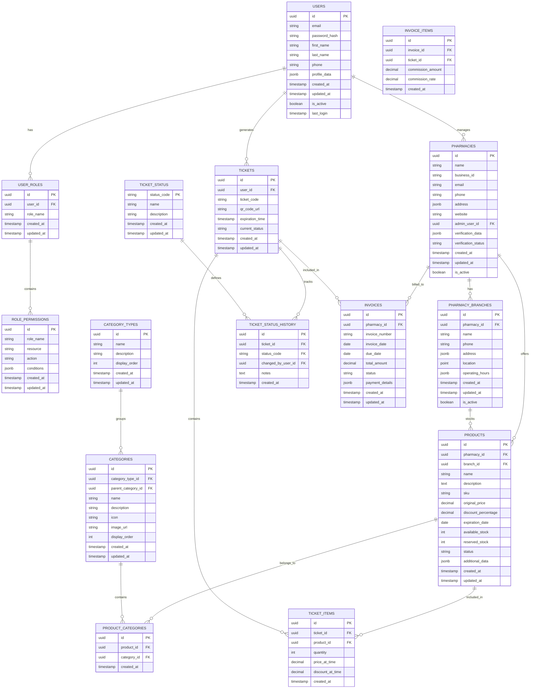

# Modelo de Datos - FarmaciaDescuento

Este documento describe el modelo de datos para el sistema FarmaciaDescuento, diseñado para PostgreSQL y gestionado a través de Hasura GraphQL Engine.

## Diagrama Entidad-Relación

## Descripción de Tablas

### Usuarios y Autenticación

#### USERS
Almacena información de todos los usuarios del sistema.
- **id**: Identificador único del usuario
- **email**: Correo electrónico (único)
- **password_hash**: Hash de la contraseña
- **first_name, last_name**: Nombre y apellido
- **phone**: Número telefónico
- **profile_data**: Datos adicionales del perfil (JSON)
- **created_at, updated_at**: Fechas de creación y actualización
- **is_active**: Estado de la cuenta
- **last_login**: Último inicio de sesión

#### USER_ROLES
Define los roles asignados a cada usuario.
- **id**: Identificador único
- **user_id**: Referencia al usuario
- **role_name**: Nombre del rol (admin_platform, admin_pharmacy, customer)
- **created_at, updated_at**: Fechas de creación y actualización

#### ROLE_PERMISSIONS
Define los permisos asociados a cada rol.
- **id**: Identificador único
- **role_name**: Nombre del rol
- **resource**: Recurso al que aplica el permiso
- **action**: Acción permitida (create, read, update, delete)
- **conditions**: Condiciones específicas para el permiso (JSON)
- **created_at, updated_at**: Fechas de creación y actualización

### Farmacias

#### PHARMACIES
Almacena información de las farmacias registradas.
- **id**: Identificador único
- **name**: Nombre de la farmacia
- **business_id**: Identificación fiscal/comercial
- **email, phone**: Contacto
- **address**: Dirección (JSON)
- **website**: Sitio web
- **admin_user_id**: Usuario administrador principal
- **verification_data**: Datos de verificación (JSON)
- **verification_status**: Estado de verificación
- **created_at, updated_at**: Fechas de creación y actualización
- **is_active**: Estado de la farmacia

#### PHARMACY_BRANCHES
Sucursales de cada farmacia.
- **id**: Identificador único
- **pharmacy_id**: Referencia a la farmacia principal
- **name**: Nombre de la sucursal
- **phone**: Teléfono de contacto
- **address**: Dirección (JSON)
- **location**: Coordenadas geográficas
- **operating_hours**: Horarios de atención (JSON)
- **created_at, updated_at**: Fechas de creación y actualización
- **is_active**: Estado de la sucursal

### Productos y Categorías

#### PRODUCTS
Productos ofrecidos con descuento.
- **id**: Identificador único
- **pharmacy_id**: Farmacia que ofrece el producto
- **branch_id**: Sucursal específica (opcional)
- **name**: Nombre del producto
- **description**: Descripción detallada
- **sku**: Código de producto
- **original_price**: Precio original
- **discount_percentage**: Porcentaje de descuento
- **expiration_date**: Fecha de vencimiento
- **available_stock**: Stock disponible
- **reserved_stock**: Stock reservado por tickets activos
- **status**: Estado (active, inactive, sold_out)
- **additional_data**: Datos adicionales (JSON)
- **created_at, updated_at**: Fechas de creación y actualización

#### CATEGORY_TYPES
Tipos de categorización (por uso, por compuesto, etc.).
- **id**: Identificador único
- **name**: Nombre del tipo de categoría
- **description**: Descripción
- **display_order**: Orden de visualización
- **created_at, updated_at**: Fechas de creación y actualización

#### CATEGORIES
Categorías para agrupar productos.
- **id**: Identificador único
- **category_type_id**: Tipo de categoría
- **parent_category_id**: Categoría padre (para jerarquías)
- **name**: Nombre de la categoría
- **description**: Descripción
- **icon**: Ícono representativo
- **display_order**: Orden de visualización
- **created_at, updated_at**: Fechas de creación y actualización

#### PRODUCT_CATEGORIES
Relación muchos a muchos entre productos y categorías.
- **id**: Identificador único
- **product_id**: Referencia al producto
- **category_id**: Referencia a la categoría
- **created_at**: Fecha de creación

### Tickets y Estados

#### TICKETS
Tickets de descuento generados por usuarios.
- **id**: Identificador único
- **user_id**: Usuario que generó el ticket
- **ticket_code**: Código único del ticket
- **qr_code_url**: URL del código QR
- **expiration_time**: Tiempo de expiración
- **current_status**: Estado actual
- **created_at, updated_at**: Fechas de creación y actualización

#### TICKET_ITEMS
Productos incluidos en cada ticket.
- **id**: Identificador único
- **ticket_id**: Referencia al ticket
- **product_id**: Referencia al producto
- **quantity**: Cantidad
- **price_at_time**: Precio al momento de generar el ticket
- **discount_at_time**: Descuento al momento de generar el ticket
- **created_at**: Fecha de creación

#### TICKET_STATUS
Posibles estados de un ticket.
- **status_code**: Código de estado (created, active, validated, used, expired, cancelled, disputed, invalid)
- **name**: Nombre legible
- **description**: Descripción del estado
- **created_at, updated_at**: Fechas de creación y actualización

#### TICKET_STATUS_HISTORY
Historial de cambios de estado de tickets.
- **id**: Identificador único
- **ticket_id**: Referencia al ticket
- **status_code**: Estado asignado
- **changed_by_user_id**: Usuario que realizó el cambio
- **notes**: Notas adicionales
- **created_at**: Fecha del cambio

### Facturación

#### INVOICES
Facturas generadas para farmacias.
- **id**: Identificador único
- **pharmacy_id**: Farmacia facturada
- **invoice_number**: Número de factura
- **invoice_date**: Fecha de emisión
- **due_date**: Fecha de vencimiento
- **total_amount**: Monto total
- **status**: Estado de la factura
- **payment_details**: Detalles de pago (JSON)
- **created_at, updated_at**: Fechas de creación y actualización

#### INVOICE_ITEMS
Ítems incluidos en cada factura.
- **id**: Identificador único
- **invoice_id**: Referencia a la factura
- **ticket_id**: Ticket procesado
- **commission_amount**: Monto de comisión
- **commission_rate**: Tasa de comisión aplicada
- **created_at**: Fecha de creación

## Índices Recomendados

Para optimizar el rendimiento de consultas frecuentes, se recomiendan los siguientes índices:

1. **USERS**: email (único), last_login
2. **PHARMACIES**: admin_user_id, verification_status, is_active
3. **PRODUCTS**: pharmacy_id, expiration_date, status
4. **TICKETS**: user_id, ticket_code (único), expiration_time, current_status
5. **TICKET_ITEMS**: ticket_id, product_id
6. **PRODUCT_CATEGORIES**: product_id, category_id
7. **PHARMACY_BRANCHES**: pharmacy_id, location (índice espacial)

## Restricciones y Validaciones

### Nivel de Base de Datos
1. **Integridad referencial**: Todas las claves foráneas deben tener restricciones de integridad referencial.
2. **Unicidad**: Correos electrónicos de usuarios, códigos de tickets, etc.
3. **Valores no nulos**: Campos críticos como user_id, pharmacy_id, etc.
4. **Restricciones de rango**: Porcentajes de descuento entre 0-100, precios positivos, etc.

### Nivel de Hasura
1. **Políticas de permisos** basadas en roles para cada tabla
2. **Validaciones personalizadas** mediante acciones de Hasura
3. **Triggers** para actualizar automáticamente campos derivados

## Consideraciones de Escalabilidad

1. **Particionamiento**: Para tablas que crecerán significativamente (TICKETS, PRODUCTS)
2. **Archivado**: Estrategia para archivar tickets vencidos y productos antiguos
3. **Índices**: Revisión periódica del rendimiento de índices y consultas
4. **Caché**: Uso de Redis para cachear consultas frecuentes
