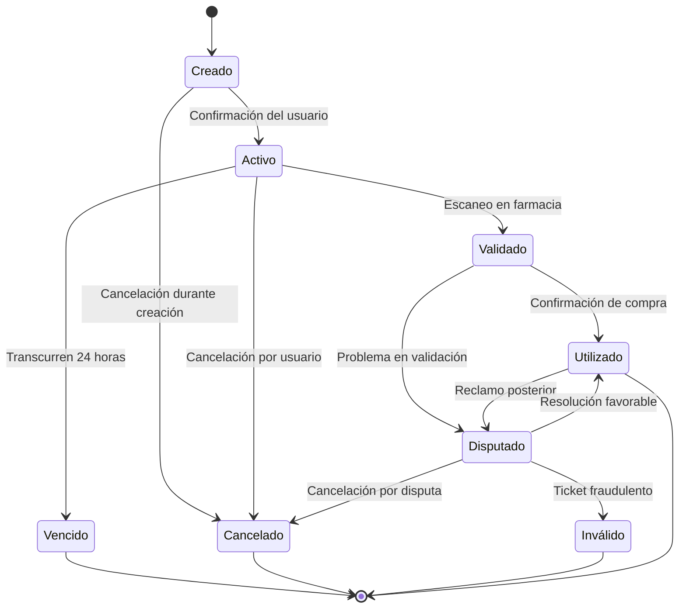

# Ciclo de Vida de Tickets de Descuento

Este documento detalla los diferentes estados por los que pasa un ticket de descuento en el sistema FarmaciaDescuento, desde su creación hasta su finalización.

## Estados de un Ticket

### 1. Creado
- **Descripción**: El ticket ha sido generado por el usuario pero aún está en proceso de confirmación.
- **Características**: 
  - No tiene asignado un código único todavía
  - No ha reservado stock
  - No es visible para la farmacia

### 2. Activo
- **Descripción**: El ticket ha sido confirmado, generado y enviado al usuario.
- **Características**:
  - Tiene asignado un código QR y alfanumérico único
  - Ha reservado temporalmente el stock correspondiente
  - Tiene una validez de 24 horas desde su generación
  - Es visible para la farmacia en su panel de tickets pendientes
  - El usuario puede presentarlo en la farmacia

### 3. Validado
- **Descripción**: El ticket ha sido escaneado y validado en la farmacia.
- **Características**:
  - La farmacia ha verificado su autenticidad
  - Se confirma que está dentro del período de validez
  - Se verifica que los productos están disponibles
  - Aún no se ha completado la transacción

### 4. Utilizado
- **Descripción**: El ticket ha sido utilizado completamente y la transacción se ha completado.
- **Características**:
  - La reserva temporal de stock se convierte en descuento permanente
  - Se registra la venta para fines de facturación
  - No puede volver a utilizarse
  - Queda en el historial del usuario y de la farmacia

### 5. Vencido
- **Descripción**: El ticket ha superado su tiempo de validez (24 horas) sin ser utilizado.
- **Características**:
  - Se libera automáticamente el stock que estaba reservado
  - No puede ser utilizado en la farmacia
  - Queda registrado como vencido en el historial del usuario
  - No genera comisión para la plataforma

### 6. Cancelado
- **Descripción**: El ticket ha sido cancelado manualmente por el usuario antes de su uso.
- **Características**:
  - Se libera el stock reservado
  - No puede ser utilizado
  - No genera comisión
  - Queda registrado como cancelado en el historial

### 7. Disputado
- **Descripción**: Existe una discrepancia o reclamo relacionado con el ticket.
- **Características**:
  - Puede ser iniciado por el usuario o la farmacia
  - Requiere revisión por parte de un administrador
  - Permanece en este estado hasta la resolución de la disputa
  - Puede derivar en utilizado, cancelado o inválido

### 8. Inválido
- **Descripción**: El ticket ha sido marcado como inválido por razones específicas.
- **Características**:
  - Puede deberse a manipulación, error del sistema o decisión administrativa
  - Libera el stock reservado
  - No puede ser utilizado
  - Requiere revisión administrativa

## Diagrama de Estados del Ticket

## Transiciones de Estado

### De Creado a Activo
- **Disparador**: El usuario confirma la generación del ticket
- **Acciones**:
  - Se genera código único y QR
  - Se reserva stock temporalmente
  - Se envía por correo electrónico
  - Se inicia contador de 24 horas

### De Activo a Validado
- **Disparador**: La farmacia escanea o ingresa el código del ticket
- **Acciones**:
  - Se verifica autenticidad y vigencia
  - Se preparan los productos
  - Se notifica al sistema que el ticket está en proceso de uso

### De Validado a Utilizado
- **Disparador**: La farmacia confirma la entrega de productos y aplicación de descuento
- **Acciones**:
  - Se marca el ticket como utilizado
  - Se convierte la reserva temporal en descuento permanente
  - Se registra para facturación
  - Se envía confirmación al usuario

### De Activo a Vencido
- **Disparador**: Transcurren 24 horas desde la generación sin ser utilizado
- **Acciones**:
  - Se marca automáticamente como vencido
  - Se libera el stock reservado
  - Se notifica al usuario

### A Estado Disputado
- **Disparador**: Usuario o farmacia reporta un problema
- **Acciones**:
  - Se registra la naturaleza de la disputa
  - Se notifica a administradores
  - Se suspende temporalmente el proceso normal del ticket

## Notificaciones por Estado

| Estado | Notificaciones al Usuario | Notificaciones a la Farmacia | Notificaciones al Administrador |
|--------|---------------------------|------------------------------|--------------------------------|
| Creado | Confirmación pendiente | - | - |
| Activo | Ticket generado, recordatorio antes de vencer | Nuevo ticket para sus productos | - |
| Validado | Ticket en proceso | Validación exitosa | - |
| Utilizado | Confirmación de uso, solicitud de valoración | Registro de venta | Ticket para facturación |
| Vencido | Notificación de vencimiento | Liberación de stock | Estadística de conversión |
| Cancelado | Confirmación de cancelación | Notificación de cancelación | - |
| Disputado | Estado de la disputa | Estado de la disputa | Nueva disputa para resolver |
| Inválido | Notificación de invalidez | Alerta de ticket inválido | Reporte de ticket inválido |

## Consideraciones Técnicas

### Seguridad
- Cada transición de estado se registra con marca de tiempo y usuario que la realiza
- Los tickets incluyen medidas anti-falsificación (códigos de un solo uso, verificación en tiempo real)
- Solo usuarios autorizados pueden cambiar estados manualmente

### Rendimiento
- El sistema monitorea constantemente los tickets activos para detectar vencimientos
- Las notificaciones se envían en tiempo real
- Las estadísticas de conversión (activo → utilizado) se actualizan constantemente

### Contingencia
- En caso de fallo del sistema, los tickets pueden validarse mediante código de respaldo
- Existe un procedimiento manual para validar tickets en caso de problemas técnicos
- Los administradores pueden forzar cambios de estado en situaciones excepcionales
