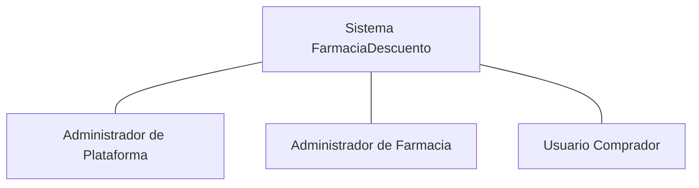
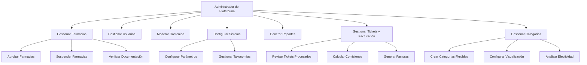
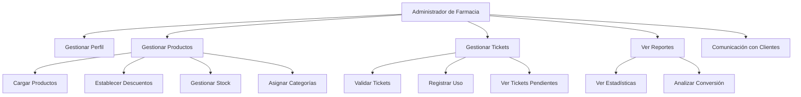
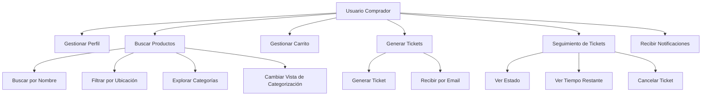
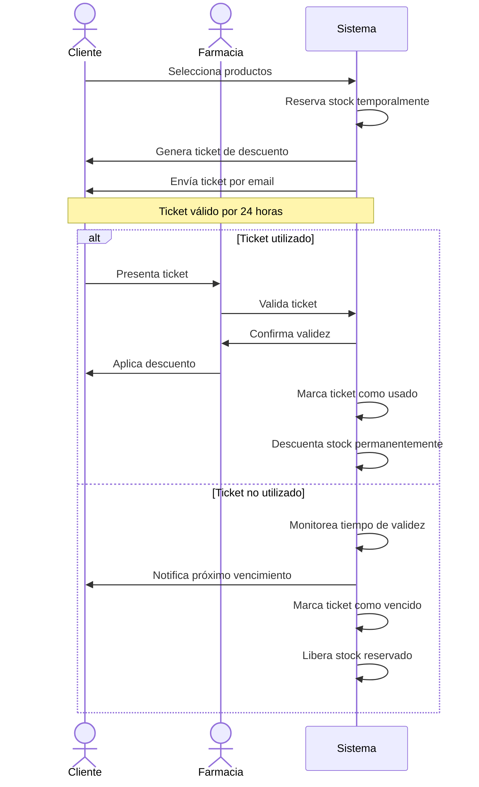
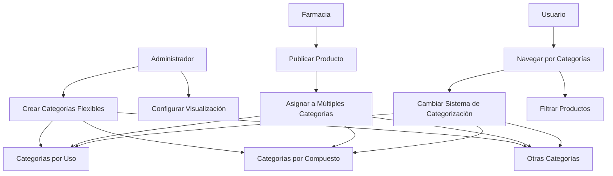
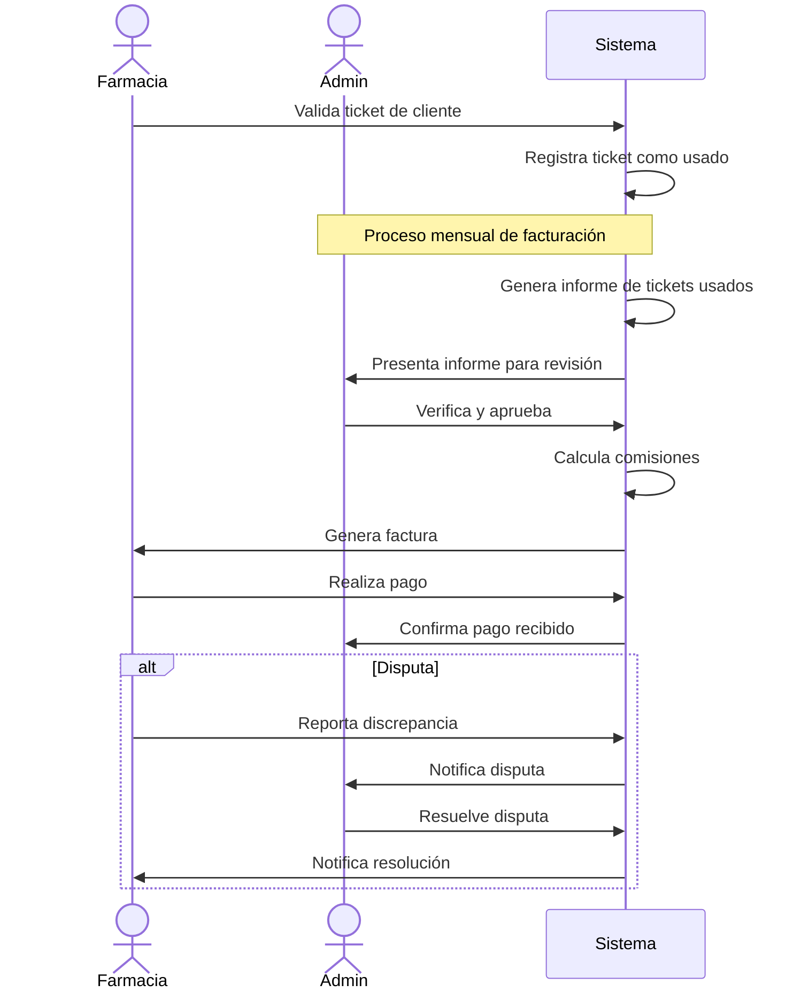

# Diagramas de Casos de Uso - FarmaciaDescuento

Este documento contiene los diagramas de casos de uso para el sistema FarmaciaDescuento, representando las principales interacciones entre los usuarios y el sistema.

## Diagrama General de Actores

## Casos de Uso para Administrador de Plataforma

## Casos de Uso para Administrador de Farmacia

## Casos de Uso para Usuario Comprador

## Diagrama de Caso de Uso: Proceso de Ticket

## Diagrama de Caso de Uso: Categorización de Productos

## Diagrama de Caso de Uso: Facturación a Farmacias

